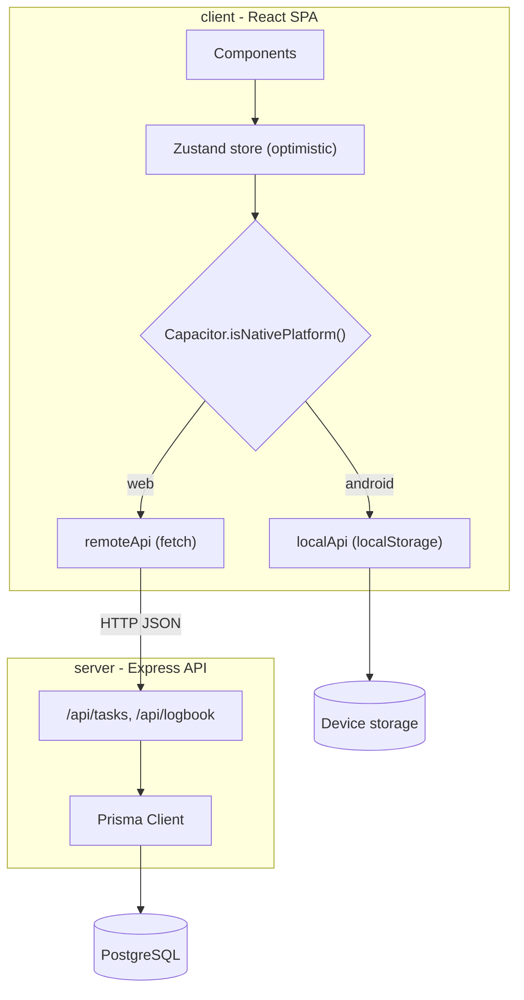
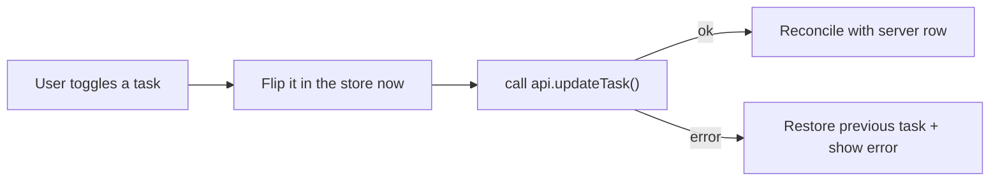

# GetToIt - Architecture

This document explains how GetToIt is designed: the components, the data model,
how requests flow, the key design decisions, and the trade-offs behind them. It
is meant to be readable both as onboarding material and as a reference.

## 1. What GetToIt is

GetToIt is a daily to-do app organized around a "clean slate" mental model:

- You only ever see **today's** tasks.
- At your local midnight, today's list is empty again - a fresh start.
- Nothing is lost: completed and past tasks are preserved and surfaced in a
  read-only **Logbook** with simple analytics.

The same product ships as a web app and as a standalone Android app, from a
single React codebase.

## 2. High-level system



There are three deployable artifacts, all from the same source:

1. **Web frontend** - the Vite/React SPA (`client/`), talks to the API.
2. **API server** - Express + Prisma + PostgreSQL (`server/`).
3. **Android app** - the same SPA wrapped by Capacitor (`client/android/`),
   running fully on-device with no server.

## 3. The "Midnight Reset" model (the core idea)

A naive daily-reset to-do app uses a scheduled server job ("at midnight, clear
everyone's tasks"). That approach is fragile:

- Whose midnight? Users live in different timezones.
- A single global cron is wrong for almost everyone, and per-user cron is
  complex and easy to break.
- It introduces server state, scheduling infrastructure, and downtime windows.

GetToIt avoids all of that. **The client owns the notion of "today."**

- The browser/device computes its local calendar day as a `YYYY-MM-DD` string
  (see [`client/src/lib/date.ts`](../client/src/lib/date.ts)).
- Every read and write carries that `localDate`.
- "Today's slate" is simply the set of tasks whose `localDate` equals today.

When the local day rolls over, the app asks for a different `localDate`, and that
query returns an empty set. No job runs. No data is mutated. No timezone math is
needed on the server. It is correct everywhere simultaneously.

```mermaid
sequenceDiagram
  participant U as User device
  participant A as Data layer
  participant D as Storage
  Note over U: It is 2026-06-20 locally
  U->>A: listTasks("2026-06-20")
  A->>D: where localDate = "2026-06-20"
  D-->>U: today's tasks
  Note over U: Clock passes midnight -> 2026-06-21
  U->>A: listTasks("2026-06-21")
  A->>D: where localDate = "2026-06-21"
  D-->>U: [] (clean slate; yesterday is untouched)
```

The frontend also schedules a timer for the next local midnight and re-checks on
window focus, so an open app rolls over on its own
(see [`client/src/App.tsx`](../client/src/App.tsx)).

## 4. One UI, two data layers

The UI never talks to a specific backend directly. It depends on a single
interface, `ApiClient`, defined in
[`client/src/lib/types.ts`](../client/src/lib/types.ts):

```ts
interface ApiClient {
  listTasks(localDate: string): Promise<Task[]>;
  createTask(title: string, localDate: string): Promise<Task>;
  updateTask(id: string, data: { title?: string; completed?: boolean }): Promise<Task>;
  deleteTask(id: string): Promise<void>;
  getLogbook(): Promise<Logbook>;
}
```

Two implementations satisfy it:

- [`remoteApi`](../client/src/lib/remoteApi.ts) - a typed `fetch` client that
  calls the Express API. Used on the web.
- [`localApi`](../client/src/lib/localApi.ts) - a fully client-side store backed
  by the WebView's `localStorage`. Used inside the native Android app, where
  there is no server.

The selection happens once, in
[`client/src/lib/api.ts`](../client/src/lib/api.ts):

```ts
export const api: ApiClient = Capacitor.isNativePlatform() ? localApi : remoteApi;
```

Because both sides implement the identical contract, the components, the store,
and the optimistic logic are 100% shared. The "Android version" is not a fork;
it is the same app with a different storage adapter.

## 5. Optimistic state management

State lives in a Zustand store,
[`client/src/lib/store.ts`](../client/src/lib/store.ts). Every mutation is
optimistic:

1. Apply the change to the in-memory list immediately, so the UI updates with no
   perceptible latency.
2. Fire the async data-layer call in the background.
3. On success, reconcile (e.g. swap a temporary id for the persisted row).
4. On failure, roll back just the affected item and surface an error.



Creates use a temporary `temp-*` id until the real record returns; toggles and
deletes snapshot the prior value so they can be reverted precisely.

## 6. Data model

Defined in [`server/prisma/schema.prisma`](../server/prisma/schema.prisma):

```prisma
model Task {
  id          String    @id @default(cuid())
  userId      String
  title       String
  completed   Boolean   @default(false)
  localDate   String    // YYYY-MM-DD, resolved on the client
  createdAt   DateTime  @default(now())
  updatedAt   DateTime  @updatedAt
  completedAt DateTime?

  @@index([userId, localDate])
}
```

- `localDate` is a **string**, not a timestamp. This is deliberate: the daily
  slate is a calendar-day concept owned by the client, and string equality is
  exact, index-friendly, and free of server timezone ambiguity.
- `@@index([userId, localDate])` makes the hot path - "today's tasks for this
  user" - a direct index lookup.
- The on-device `localApi` mirrors this shape exactly (same fields), so data is
  conceptually identical whether it lives in PostgreSQL or `localStorage`.

### Single-user mode
Tasks are attributed to a constant `DEFAULT_USER_ID`
([`server/src/constants.ts`](../server/src/constants.ts)). The schema and all
queries are already keyed on `userId`, so introducing real authentication later
is a localized change: source `userId` from a session instead of a constant.

## 7. The API server

Express app in [`server/src/index.ts`](../server/src/index.ts), with routes
split by resource:

| Method | Path                       | Handler                                                   |
| ------ | -------------------------- | -------------------------------------------------------- |
| GET    | `/api/tasks?localDate=...` | [`routes/tasks.ts`](../server/src/routes/tasks.ts)       |
| POST   | `/api/tasks`               | create                                                   |
| PATCH  | `/api/tasks/:id`           | toggle completion (sets `completedAt`) / rename          |
| DELETE | `/api/tasks/:id`           | delete                                                   |
| GET    | `/api/logbook`             | [`routes/logbook.ts`](../server/src/routes/logbook.ts)   |

Cross-cutting concerns:

- **Validation:** every request body/query is parsed with zod schemas
  ([`server/src/validation.ts`](../server/src/validation.ts)). Invalid input is
  rejected with a `400` and a structured error.
- **Error handling:** a central error middleware maps `ZodError` to `400` and
  everything else to `500`.
- **CORS:** restricted to the configured frontend origin(s).
- **Prisma client:** a singleton ([`server/src/prisma.ts`](../server/src/prisma.ts))
  to avoid exhausting connections during dev hot-reload.

### Logbook aggregation
The Logbook groups tasks by `localDate` and reports, per day, the total count,
completed count, and completion rate, plus an overall summary. On the server
this uses Prisma `groupBy`; on the device, `localApi` performs the same
aggregation in memory over the stored array, so the Logbook works offline too.

## 8. Mobile: Capacitor

[Capacitor](https://capacitorjs.com/) wraps the built web app in a native
Android shell (a `WebView` plus native tooling), configured in
[`client/capacitor.config.ts`](../client/capacitor.config.ts):

- `appId`: `com.electleaf.gettoit`
- `webDir`: `dist` (the Vite build output)

Build flow: `vite build` -> `cap sync android` (copies `dist` into the native
project and updates plugins) -> Gradle assembles the APK. Because the native app
uses `localApi`, the resulting APK is self-contained and offline-capable.

> Capacitor 8's CLI requires **Node >= 22**. This matters in CI (see below) and
> is recorded in `client/package.json` `engines`.

## 9. CI/CD: cloud APK builds

Defined in
[`.github/workflows/android.yml`](../.github/workflows/android.yml). On every
push to `main` (and on manual dispatch), GitHub Actions:

1. Checks out the repo.
2. Sets up Node 22, JDK 21, and the Android SDK (installs platform/build-tools
   for compileSdk 36).
3. `npm ci` -> `npm run build` -> `npx cap sync android`.
4. `./gradlew assembleDebug` to produce the APK.
5. Uploads the APK as a build artifact and publishes it to the
   `android-latest` GitHub Release for easy download.

This means a working APK can be produced without any local Android toolchain -
the cloud runner is the build machine, and the release is the distribution
channel.

## 10. Design decisions and trade-offs

| Decision | Why | Trade-off |
| --- | --- | --- |
| Client-owned `localDate` string instead of server cron | Correct in all timezones; no scheduler, no downtime | Client clock is trusted (fine for a personal to-do app) |
| Two data layers behind one interface | Web keeps a real DB; Android works offline; code stays shared | Two storage backends to keep in sync conceptually |
| On-device `localStorage` for Android | Zero infra; instant; offline | Per-device data, no cross-device sync (by design for now) |
| Optimistic UI | Low-latency, responsive feel | Must implement careful rollback |
| Single-user (`DEFAULT_USER_ID`) | Removes auth scope while staying multi-user ready | No real accounts yet |
| Capacitor over a native/React Native rewrite | Reuse 100% of the web UI | Runs in a WebView rather than native views |

## 11. Possible next steps

- Real authentication, replacing `DEFAULT_USER_ID` with session-derived ids.
- Cross-device sync for mobile by pointing `localApi` users at the hosted API
  (or a sync layer) once a public backend is deployed.
- A public web deployment (static host for the SPA + hosted Postgres for the API).
- Tests: API integration tests and store unit tests for the optimistic paths.
